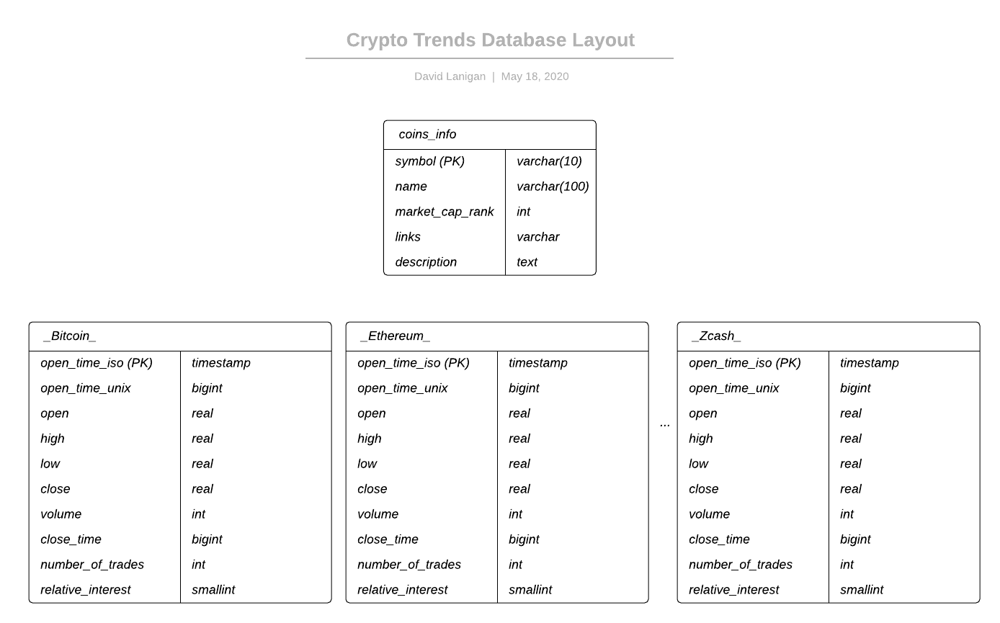

# Crypto Data Trends Project

### INTRO
This purpose of this project is to download, consolidate, transform and prepare cryptocurrency price, volume and google trend data for analysis and exploration.<br/>
<br>
To accomplish this a list data was acquired from (3) different sources. The first was [coingecko API](https://www.coingecko.com/en/api) where a list of viable coin candidate were pulled along with information about each coin. hose coins ranked in the top ~50 by market cap that were supported on Binance. Binance was chosen for its ubiquity as a cryptocurrency exchange, strong API and fairly low trading fees. The historical data was then pulled from binance API with a [python wrapper](https://github.com/sammchardy/python-binance) using [USDT](https://tether.to/) as the base currency. The google trends data was pulled from google (a very time consuming process because google is very unfreindly to those who need their trends data) using a [pytrends](https://github.com/GeneralMills/pytrends) module.<br/>
<br>
NOTE: The to decrease the time to download the google trends data the binance data is collected first - the the latest date from the data for each coin is used as the latest date for the google trends data. May 1, 2020 was used as the earliest date.<br/>
<br>
The data was then transfered into a postgresql database a table for each coin (price info and trends info) and a single table for the list of coins and information. The outline of the database can be seen below.<br/>
<br>
Postgres was chosen as the database because of its wide use, open source nature my already personal familiarity with pyscopg2. Pandas python library proved to be a useful data manipulation tool as well.




### STRUCTURE

```
├── data                                                                                         
│   ├── coins                                                                                                        
│   │   ├── 0x.csv                                                                                                          
│   │   ├── Algorand.csv                                                                                                     
│   |   └── ...                                                                                       
│   ├── coins.csv
│   └── interest
│       ├── Basic-Attention-Token.csv
│       ├── Bitcoin.csv
│       └── ...
├── README.md
├── requirements.txt
├── db.png
└── src
    ├── example_config.json
    ├── etl.py
    ├── get_data.py
    ├── collect_data.py
    ├── append_data.py
    ├── get_data.py
    ├── test_.py
    └── sql_queries.py

```

### SET UP

#### Requirements
* Python 3
* pandas
* pytrends
* python-binance
* datetime
* psycopg2
* requests

The configuration file should be edited. The example_config.json cann be used for this.

To re-download all the data (will take a few days) and then create databases - run the scripts the following way:
```
>> python3 collect_data.py
>> python3 etl.py
```
Otherwise to append data to the pre-made .csv files. Run the scripts in the following way:
```
>> python3 append_data.py
>> python3 etl.py
```

If you all collecting data from scratch for the first time under the [data] section change trends_get/coins_get=append to trends_get/coins_get=collect.
If the you leave the "get" flags to  append then the files will search the .csv files for the last date collect and begin collection from there. Additionally only dates that have not been added to the postgres databases will be added.<br/>
<br>
For both appending data to .csv files and sending data to the database only coins with BOTH interest and price data will be added.


### NOTES/DISCUSSION


Sample SQL queries that are desirable to run are the following:
```
db=# SELECT open_time_iso,open,relative_interest FROM _Bitcoin_ WHERE relative_interest > 20;
```

##### Use with Spark:
Use with Spark, an popular big-data analysis tool can be used to analysis the data easily since the data is store in a postgres databse. You could also use Spark to access the .csv directly.


##### Use with airflow:
For use with airflow the following DAG structure is recommended:
```
get_coin_info>>get_price_data>>get_trends_data>>etl_to_database
```
The data base model is simple and allows for easy access to coin specific data for comparing prices and trends.<br/>
<br>

Data should be updated as frequently as new analysis needs to be accomplished based on coin price trends. If an interesting price or trend movement occurred and the instance needs to be investingated the data should be updated.<br/>
<br>

* If the data was increased by 100x, I would change little except for the interest data acquisition, the function gathering it would have to be changed. Currently, there is a loop which adds a wait period of a few minutes for every collection call which gets a week of data. However, it would take about about a year to collect 100x the data at the current rate.  Therefore, more clever way of collecting the data would have to be implimented, requiring a change to the pytrends api call function - maybe by pausing only when a 429 reponse is recieved and continuing to add time if the 429 is coninued to be recieved, then going back to zero wait time when it goes away. Also, right now the "append" and "collect" options are only for the .csv file. This is because the operation is fairly quick. However, with 100x more data an append option for the database would be warranted. 
* If the pipelines were run on a daily basis by 7am,  I wouldnt change anything. The dates recieved are by the hour and can be specified hourly.
* If the database needed to be accessed by 100+ people and was 100x the size a move to a nosql database like MongoDB might be warranted.
